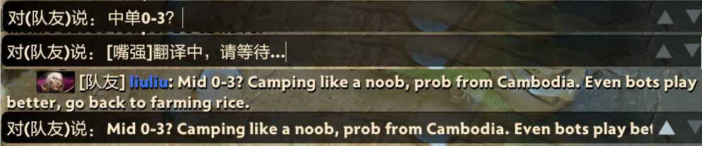



  

## 嘴强 - MouthKing

### 📄 这是什么？
这是一个基于 DeepSeek 的游戏内翻译工具，只是翻译的措辞会比较犀利，多用于对骂 

### ❓为什么做它
之前看到过一款叫[DeepRant](https://github.com/liseami/DeepRant/)的工具，但是在windows下似乎有些问题，同时基于练手的目的，我也做了一个类似的。在此要感谢DeepRant

### ⏩ 如何使用
运行程序后，在游戏内的输入框中输入文字，不要发送出去，按快捷键即可（默认Ctrl+T）

### 🐔 其他技巧
也可以中文到中文的“翻译”，丰富你的中文措辞

### 👿 是否会被封号/VAC？
不会，因为这只是一个翻译工具，和其他翻译工具一样，不会对游戏内存进行任何操作

### ⬇️ 下载地址

### 🔣 开发相关
- 开发语言：C# / .Net
- 框平台桌面框架：Avalonia

